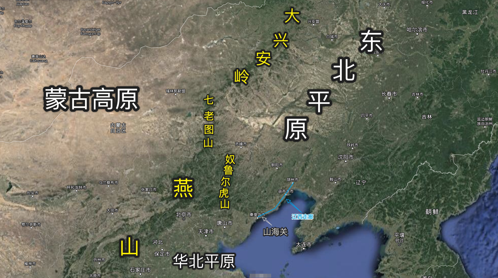

# 伪满军演

## 孤峰汇报

坐在藤原会社当中的宁志恒正思索对策，想起今天是周五，于是便换好衣服，准备出门，照例前往南屋书馆。

到达南屋书馆后，宁志恒跟店员打了个招呼，而后就径直前往自己在南屋书馆的办公室看书。少倾，就听见敲门声，而后听见何思明的声音：「藤原君，我是竹下。」宁志恒起身给何思明开门，而后二人在屋里相对而坐。

宁志恒开口问道：「思明，特高课那边近期有什么情况吗？」何思明摇摇头，答道：「最近没什么特别的情况，我也乐得清闲。」宁志恒听闻不禁莞尔，又听何思明继续说道：「不过，佐川太郎今天命令我，准备下周随他前往大连。」宁志恒闻言皱眉，道：「去大连做什么？」何思明答道：「佐川太郎没细说，只说是临时支援，我也没问。」宁志恒说：「没事，你做得很好。一切都要以你自身的安全为先，不该打听的不开口是对的，免得惹人怀疑。」

略一思忖，宁志恒又道：「佐川有说什么时候离沪吗？」何思明道：「具体时间没有说明。不过我估计是在下周二或周三的时间。」

宁志恒思索片刻，仍不得要领，没有回忆起这个时候日军在大连有什么行动。于是，宁志恒又与何思明交代一番，便先后离开了南屋书馆。

## 收悉情报

回到藤原会社，宁志恒就听易华安汇报：「收到霍科长发来的电报，说是获得了关于日军下一步战略动向的情报。事情重大，霍科长难以抉择，请您回谭公馆一趟，主持工作。」

宁志恒深知霍越泽的能力和脾气秉性，寻常情报，根本无需如此大动干戈。在电报中没有透漏分毫情报信息，又郑重其事地请自己回去，想必是确有重大情况发生。何况，日军下一步的战略动向也是自己正暗自头疼的事情。故而立即起身，对易华安说到：「收拾好藤原会社这边的事情，我们今天晚些时候回一趟谭公馆。」

## 安排行动

一路回到谭公馆，得到消息的霍越泽屏退其他人，在房间中向宁志恒回报。原来，霍越泽从情报市场上获得消息，日本关东军在进行了长期训练之后，七月初准备在大连进行一场军事演习。由于关东军驻扎的伪满与苏联接壤，关东军举行军演是十分敏感的事情，可能涉及到日军接下来的战略动向。这样看来，何思明受命前往大连，应该是与此事有关。

宁志恒不禁皱眉。无论是自己熟知的历史，还是自己目前掌握到的日本的情报，日本都应该南下而非北上。而且，关东军所在伪满是日本最早占领的中国领土，从局势上分析，近期并无需要关东军出动的大规模战士。从时间上分析，关东军选在这个时间举行军事演习，肯定跟日军下一步的战略动向有关。但从地理位置上分析，选择南下的日军为什么要让关东军训练和演习？

宁志恒思虑甚深，有了一个疑点就不肯放过。但思考下来却暂无头绪。突然，宁志恒想到近期国际局势风云诡谲，遂向霍越泽提问：「这个情报是从谁手里买到的？」霍越泽闻言一愣，而后答道：「这个情报很多情报贩子手里都有，看起来并非是独家情报。不过我买来之后，正见菲利普斯朝我举杯微笑。显然，他一直关注着我的动向。结合近期情报收购的工作来看，我认为这个情报最开始就是从菲利普斯那里流传出来的。」

宁志恒对这个回答很有兴趣。菲利普斯是美国领事馆的武官，暗地里做着情报和军火的生意，不久前还和情报科这边结了个善缘。于是，宁志恒开口询问：「最近菲利普斯那边的情报很多吗？都是有关什么内容的？」霍越泽略一思考之后回答，说：「您要不提我还没发觉。最近菲利普斯贩卖的情报确实比往常多了不少。如果这还不能说明问题的话，和其他贩子相比，菲利普斯在实力上其实没有明显优势，但最近他关于日军动向的情报明显比其他人要多得多。」

宁志恒摩挲着下巴，微笑道：「这就对了。本身美国是保持中立的，对日本和我们都做生意。但因为日本的工业基础好，所以实际上对日本的帮助更大。但最近国际局势变化，看起来美国坐不住了。美国对日本的动向愈发关注，态度也原来越强硬。菲利普斯的情报数量的变化，正好佐证了这一点。」

宁志恒继续道：「这次你办得很好。接下来要继续收集日军动向这方面的情报。」顿了一下，宁志恒略一思索，继续对霍越泽吩咐到：「这个情报确实重要，而且时间上很敏感。看起来，美国人跟我们想到一起去了。我们不能光依赖情报市场这一个来源，现在局势不明朗，是时候让大家活动活动了。你把宏义叫来。」

不久，霍越泽带着季宏义一起回来。宁志恒对季宏义说：「日军关东军计划在七月初举行军演，地点在大连。我决定让你带几个头脑灵活、身手利索的弟兄去一趟大连，打探打探情况。」顿了一下，见季宏义没有流露出畏难情绪，不禁暗自赞许。宁志恒继续将行动方略向季宏义吩咐道：「这次行动，主要是去探听关东军演习的规模和虚实。也就是说，这次任务对时效性强的战术性情报没有需求，主要关注时效性较弱的战略情报。因此，这次去大连，以被动获取情报为主。你要知道，军队的事情，不光是士兵的问题。粮草、装备，这些东西的调配都能反映出军事动向而很难做得无人知晓。为筹集粮草装备，就要用钱买。关东军也不是那么富裕，既然要筹钱，就一定会有相应的动作。因此，此去大连，我们虽然没有根基，变数也多。但只要行动时小心行事，以观察和听说侧面情报为主，也是能分析出很多有价值的情报的。这样一来，合理地设计行动人员的掩饰身份，从而能够将随行人员投入情报获取便利的场所就很重要了。你们扮成一个商队，载着东北相对稀缺，但是需求量又较大的商品，比如米面，前往大连贩卖。」季宏义一听就明白了宁志恒的意思，点头应是。

略一停顿，季宏义又道：「处座，去大连后，联络的问题怎么解决？」宁志恒闻言微微一笑，说：「如果能用电台，当然最好。但是此去路途遥远，变数很多，而且我们在大连没有根基，用电台太危险了。好在这次任务的情报时效性不高，因此你们去了大连，只要每周以进货的理由，派人回来一趟即可。此外……」

宁志恒本打算让季宏义运一些大米、面粉去到东北贩卖。这样解决打探情报的问题的同时，也能解决一些缺衣少食的东北同胞的生活问题。但念及前几年京城^[指南京。]城破时，日军野岛一郎等人指使日军犯下的罪行罄竹难书，宁志恒又觉得应以最坏的恶意揣测占据东北扶植伪满的日军。在宁志恒想来，东北沦陷多年，那里的同胞怕是连吃一口白米饭都是犯罪。往大连贩售大米、面粉，且不说能不能运进城而不被拦截，要真是卖给了东北的同胞，怕是反而害了他们。思虑再三，宁志恒决定让季宏义他们去贩卖山货、烟草等物品。这些东西东北本身产量较少，但是需求广泛，兼之山货是江浙一带的特产之一。更重要的是，这些东西算不上太重要的战略物资，被盘查时给些好处也就能过去了，天生就减少了被日军全部截胡的可能性。宁志恒心中计定，继续对季宏义说：「这样，你们别卖米面了，不要徒惹事端。你们收点山货、烟草，拉到大连去贩卖。在大连港盘下门面之后，起名『恒宏山货』。如果没有特殊情况，就按之前说的，每周派人回报即可。若是有特殊情况发生，我这边会派人带着另一半玉佩过去与你接头。」说着，宁志恒将两个类似虎符的玉佩的其中一个，交给季宏义。

季宏义听完再无疑问，遂保证道：「请处座放心，属下保证完成任务，并将带出去的兄弟们全须全尾地带回来。」宁志恒闻言，放心地拍了拍季宏义的肩膀，而后便准备离开谭公馆。

## 双管齐下

周一一大早，宁志恒再次前往南屋书馆等待何思明。约莫十点半时，何思明敲开了宁志恒位于南屋书馆办公室的房门。

房门关上，何思明不待落座，就对宁志恒汇报到：「处座，任务下来了。明天我就会随着佐川太郎前往大连，随行的还有二十多人。虽然佐川太郎没有明说任务内容，但是除我之外^[这就很灵性了。]，佐川太郎挑选的都是行动好手。看这架势，大连那边一定是要有大动作了，需要我们过去支援。」

宁志恒闻言一乐，心道这何思明真是一员福将^[铁憨憨有铁憨憨的福气。]。季宏义他们去大连，因为安全原因，只能在外违被动收集情报并加以分析。宁志恒正发愁如何获得伪满军演的更多细节，何思明就带来这么个消息。按宁志恒的考虑，佐川太郎一定是被伪满特高课邀请过去协助维持军演观礼的安保和秩序。这样一来，按照何思明的地位，军演的诸多细节，一定逃不开何思明的眼睛。

心念及此，宁志恒对何思明吩咐道：「你猜的没错，日军在大连接下来会有一场军事演习，时间初步定在七月初。大连是伪满大城市之一，伪满最大的港口也在此。因此，这个时间在大连军演一定有特别的战略目的。此去大连，你多多关注演习的细节。比如演习的科目、参演的部队等等。待返回上海之后，再向我汇报。」

## 过山海关

6 月 27 日，准备妥当的季宏义带着挑选的五个探员，一路向北。到达山海关城时，由于即将进入伪满，一行人购买了新的马车，将货物从卡车上卸下，装上马车，准备休息一日后再出发。

跟在宁志恒身边多年，季宏义也逐渐养成了未虑胜先虑败的习惯。在山海关前，季宏义开始思考，若在伪满发生万一，要如何安全撤离。

伪满地处东北平原。向北是苏联，向东向南都是大海。向西是蒙古高原，但有大兴安岭横亘南北阻隔。向西南则是华北平原，但也有七老图山、奴鲁尔虎山和燕山这一片连绵不绝的山脉阻隔。从地理的角度来说，这些山脉把蒙古高原、东北平原和华北平原分割成了相对独立的地理单元。从东北向华北行进，若是不想翻越连绵不绝的山脉，就只能取道辽西走廊。（参考图 \ref{fig:01}）

辽西走廊是一片非常狭窄而又细长的平地，位于辽西山区的东边。辽西走廊再往东，就是渤海。^[辽西走廊经常发生海侵现象。在相当长的历史时期内，走廊地表积水严重，形成连片沼泽。曹丞相远征乌桓时，因辽西走廊积水严重，以至于「浅不通车马，深不载舟楫」，实在无法通行而不得不绕行。曹丞相征乌桓回军的时候，正值正月，故从辽西走廊回军。到达碣石时，写下了千古名作「东临碣石，以观沧海」。]这种地形自古以来就是易守难攻的。明朝末年袁崇焕布置的防线就是针对辽西走廊的。从南到北，分别是赵率教防守山海关，袁崇焕自己坐镇宁愿^[现在葫芦岛市下辖的兴城市。]，祖大寿防守锦州。三道防线扼守辽西走廊，拥有足够的战略纵深，皇太极数次进攻不克，最终不得不绕过辽西山地才最终入主中原。

辽西山区的地形险要，如果任务出现万一，不走辽西走廊撤回，而从卢龙道^[南向北走：卢龙口 -- 凌源 -- 大凌河 -- 朝阳。这是最早开通的通往东北平原的道路，上溯至商周时代就有记录。]或者古北道^[南向北走：北平 -- 顺义 -- 密云 -- 古北 -- 滦河 -- 平泉 -- 巴林左旗。]撤回的话，一则道路崎岖，几乎全是沿着河谷而行，耽误时间；二则路途遥远，疾行撤退时无法携带太多干粮，怕是要饿死在半道。至于从大连港直接走水路扯往天津就更不必谈——在日军舰队的坚船利炮威胁下，几条命都不够用的。因此，若要安全撤离，必须要借道辽西走廊。

只是借道辽西走廊，就免不了要过山海关。要过山海关，就不得不面对关内守卫。这是因为山海关本就是雄关，更兼末端城墙直入渤海形成龙头状的箭楼。因此，想要巧妙地绕过山海关，基本是不可能的事情。而若要解决关内守卫，就必须对关内地形和布置了如指掌才行。
