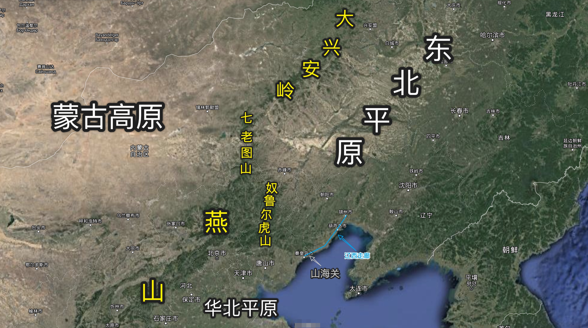

# 动身北上

## 双管齐下

周一一大早，宁志恒再次前往南屋书馆等待何思明。约莫十点半时，何思明敲开了宁志恒位于南屋书馆办公室的房门。

房门关上，何思明不待落座，就对宁志恒汇报到：「处座，任务下来了。明天我就会随着佐川太郎前往大连，随行的还有二十多人。虽然佐川太郎没有明说任务内容，但是除我之外^[这就很灵性了。]，佐川太郎挑选的都是行动好手。看这架势，大连那边一定是要有大动作了，需要我们过去支援。」

宁志恒闻言一乐，心道这何思明真是一员福将^[铁憨憨有铁憨憨的福气。]。

季宏义他们去大连，因为安全原因，只能在外违被动收集情报并加以分析。宁志恒正发愁如何获得伪满军演的更多细节，何思明就带来这么个消息。

按宁志恒的考虑，佐川太郎一定是被伪满特高课邀请过去协助维持军演观礼的安保和秩序。这样一来，按照何思明的地位，军演的诸多细节，一定逃不开何思明的眼睛。

心念及此，宁志恒对何思明吩咐道：「你猜的没错，日军在大连接下来会有一场军事演习，时间初步定在七月初。大连是伪满大城市之一，伪满最大的港口也在此。因此，这个时间在大连军演一定有特别的战略目的。此去大连，你多多关注演习的细节。比如演习的科目、参演的部队等等。待返回上海之后，再向我汇报。」

## 山海关城

6 月 27 日，准备妥当的季宏义带着挑选的五个探员，一路向北。到达山海关城时，由于即将进入伪满，一行人购买了新的马车，将货物从卡车上卸下，装上马车，准备休息一日后再出发。

跟在宁志恒身边多年，季宏义也逐渐养成了未虑胜先虑败的习惯。在关城内，季宏义开始思考若在伪满发生万一，要如何安全撤离。

伪满地处东北平原。向北是苏联，向东向南都是大海。向西是蒙古高原，但有大兴安岭横亘南北阻隔。向西南则是华北平原，但也有七老图山、奴鲁尔虎山和燕山这一片连绵不绝的山脉阻隔。从地理的角度来说，这些山脉把蒙古高原、东北平原和华北平原分割成了相对独立的地理单元。

从东北向华北行进，若是不想翻越连绵不绝的山脉，就只能取道辽西走廊。（参考图 \ref{fig:01}）

辽西走廊是一片非常狭窄而又细长的平地，位于辽西山区的东边。辽西走廊再往东，就是渤海。^[辽西走廊经常发生海侵现象。在相当长的历史时期内，走廊地表积水严重，形成连片沼泽。曹丞相远征乌桓时，因辽西走廊积水严重，以至于「浅不通车马，深不载舟楫」，实在无法通行而不得不绕行。曹丞相征乌桓回军的时候，正值正月，故从辽西走廊回军。到达碣石时，写下了千古名作「东临碣石，以观沧海」。]

这种地形自古以来就是易守难攻的。

明朝末年袁崇焕布置的防线就是针对辽西走廊的。从南到北，分别是赵率教防守山海关，袁崇焕自己坐镇宁愿^[现在葫芦岛市下辖的兴城市。]，祖大寿防守锦州。三道防线扼守辽西走廊，拥有足够的战略纵深，皇太极数次进攻不克，最终不得不绕过辽西山地才最终入主中原。

辽西山区的地形险要，如果任务出现万一，不走辽西走廊撤回，而从卢龙道^[南向北走：卢龙口 -- 凌源 -- 大凌河 -- 朝阳。这是最早开通的通往东北平原的道路，上溯至商周时代就有记录。]或者古北道^[南向北走：北平 -- 顺义 -- 密云 -- 古北 -- 滦河 -- 平泉 -- 巴林左旗。]撤回的话，一则道路崎岖，几乎全是沿着河谷而行，耽误时间；二则路途遥远，疾行撤退时无法携带太多干粮，怕是要饿死在半道。至于从大连港直接走水路扯往天津就更不必谈——在日军舰队的坚船利炮威胁下，几条命都不够用的。

因此，若要安全撤离，必须要借道辽西走廊。

只是借道辽西走廊，就免不了要过山海关。要过山海关，就不得不穿过关城。这是因为山海关本就是雄关，更兼末端城墙直入渤海形成龙头状的箭楼。

因此，想要巧妙地绕过山海关，根本是不可能的事情。

至于穿过山海关城，季宏义一行人人手有限，又兼没有地利；在危机中若要脱身，强取关城守卫那是硬撞南墙，必须要借助天时才行。

当天晚上，安顿其他弟兄歇息，强调纪律不得外出之后，季宏义喊上杨文广^[为避免与原著可能的冲突，这里生造一些配角，以满足剧情。还请原作和读者见谅。]一同行动。

这杨文广与北宋杨家将杨延昭之子同名，行事作风也颇有杨家将后人的风范。

杨文广出生市井，但勇武忠义；心思难说细致，但却十分机敏。加入青帮之后，也混出了一定名堂。季宏义此次带上杨文广出门，正是看重了他的能力和性格。

悄无声息地潜出酒店，在一处僻静无人的深巷内，季宏义向杨文广交待道：「文广，此次行动我们孤军深入，虽是正经做买卖，不做其他额外的事情，只是被动地听别人的交谈。但伪满毕竟是日本人经营已久的地方，我们是生面孔，天然就惹人怀疑。若是有个什么突发情况，首先就容易怀疑到我们头上来。所以我们得提前找好一条退路。」

「另外，我们孤悬在外。虽然处座说此次行动获取情报的时效性不是重点，但若能更加及时一天，也会对抗战局势有所帮助。所以我们如果能打通一条秘密的通道，平时能传送信息，紧急情况能运人就再好不过了。」

看杨文广神情严肃，季宏义拍拍他的肩膀，示意他放松，而后道：「不用这么严肃。我的想法是这样的：要过山海关，我们肯定不能跟关城内的守军起冲突。这样的话，我们最好就要找一个原本就会穿过山海关的通道，然后潜藏其中，暗度陈仓。」

「今天白天，我看到车站有火车从关内往关外去。火车一路滴水，而且有煤味。」

「关内离这里最近的煤矿是唐山的开滦煤矿。日本人一定是在往东北调运原煤，生产军火。」

「火车有去就一定有来。我们若能搭上这个顺风车，就能神鬼不知地穿过山海关。」

「现在的问题有两个。一是我们不知道火车的班次表，也就不知道时间。二是若要借助铁路穿行，就免不了有人明面上去打交道。」

顿了顿，季宏义对杨文广道：「我这里要交给你两个任务。一是今晚随我一起去摸清楚火车的班次表，搞清楚列车班次。二是等到了伪满，你要定期以进货的名义来往这条线路。」

解释清楚来龙去脉后，季杨二人就向着山海关车站摸去。
